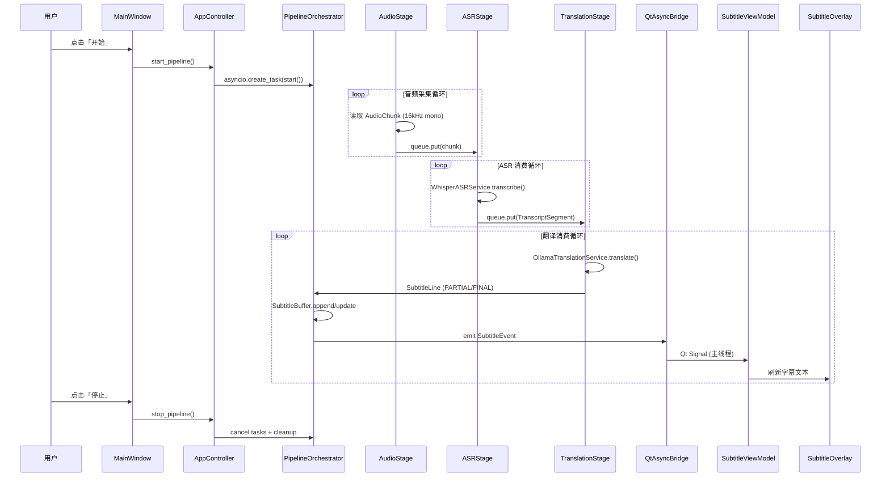

# AI 同声传译助手 — 架构设计文档

> 版本：MVP v0.1  
> 技术栈：Python 3.11 · PySide6 · Faster-Whisper · Ollama · asyncio  
> 状态：设计阶段（不含实现代码）

---

## 1. 文档目的

本文档定义本地 AI 同声传译助手的**模块化架构**、**类关系**、**数据流**与**模块职责**，作为 MVP 及后续迭代的实现依据。

### 1.1 MVP 范围

| 包含 | 不包含（后续迭代） |
|------|-------------------|
| 系统音频采集 | TTS 语音播报 |
| Faster-Whisper ASR 转写 | 多源语言切换 |
| Ollama LLM 翻译为中文 | 云服务 / 用户登录 |
| PySide6 字幕叠加显示 | 完整设置中心 |
| asyncio 异步流水线 | 云端模型路由 |

### 1.2 架构目标

1. **模块化**：每个能力域独立包，通过接口契约通信。
2. **UI 与业务彻底分离**：UI 层只负责展示与用户交互，不直接调用 ASR / LLM。
3. **可扩展**：所有外部依赖（音频源、ASR、翻译器）均面向接口编程，便于替换实现。
4. **异步优先**：核心流水线基于 asyncio，避免阻塞 Qt 主线程。
5. **可测试**：业务逻辑可在无 GUI 环境下单元测试。

---

## 2. 分层架构

```
┌──────────────────────────────────────────────────────────────────────┐
│                        Presentation Layer (ui/)                      │
│   MainWindow · SubtitleOverlay · ViewModel · Qt Signals/Slots        │
└───────────────────────────────┬──────────────────────────────────────┘
                                │ 事件 / 命令（经 Bridge，非直接调用）
┌───────────────────────────────▼──────────────────────────────────────┐
│                      Application Layer (app/)                        │
│   Bootstrap · AppController · 生命周期管理 · 依赖注入装配              │
└───────────────────────────────┬──────────────────────────────────────┘
                                │
┌───────────────────────────────▼──────────────────────────────────────┐
│                        Core Layer (core/)                            │
│   PipelineOrchestrator · Domain Models · Events · Stage 抽象         │
│   CorrectionEngine（预留）· SubtitleBuffer                           │
└───────────────────────────────┬──────────────────────────────────────┘
                                │ 接口调用（Protocol / ABC）
┌───────────────────────────────▼──────────────────────────────────────┐
│                    Infrastructure Layer (services/)                  │
│   SystemAudioCapture · WhisperASRService · OllamaTranslationService  │
└───────────────────────────────┬──────────────────────────────────────┘
                                │
┌───────────────────────────────▼──────────────────────────────────────┐
│                  Cross-cutting (infrastructure/)                     │
│   Config · Logging · QtAsyncBridge · ThreadPoolExecutor              │
└──────────────────────────────────────────────────────────────────────┘
```

### 2.1 依赖规则（单向）

- `ui/` **不得** import `services/` 中的具体实现，仅依赖 `core/` 中的 ViewModel 适配器或事件类型。
- `core/` **不得** import `ui/`，通过 `asyncio.Queue` 或 Observer 模式向外推送事件。
- `services/` 实现 `core/interfaces/` 中定义的 Protocol，**不得** import `ui/`。
- `app/` 作为**组合根（Composition Root）**，负责装配全部依赖，是唯一允许横层 import 的模块。

---

## 3. 完整目录结构

```
AI-/
├── app/                              # 应用入口与装配
│   ├── __init__.py
│   ├── __main__.py                   # python -m app
│   └── bootstrap.py                  # 依赖注入、启动 asyncio loop + Qt
│
├── ui/                               # 表现层（PySide6，零业务逻辑）
│   ├── __init__.py
│   ├── main_window.py                # 主窗口：开始/停止、状态指示
│   ├── subtitle_overlay.py           # 透明置顶字幕窗口
│   └── view_models/
│       ├── __init__.py
│       └── subtitle_view_model.py    # 将 core 事件转为 Qt 可绑定状态
│
├── core/                             # 领域核心（纯 Python，无 Qt 依赖）
│   ├── __init__.py
│   ├── models.py                     # AudioChunk, TranscriptSegment, SubtitleLine
│   ├── events.py                     # 领域事件枚举与 dataclass
│   ├── interfaces/                   # 抽象契约（Protocol / ABC）
│   │   ├── __init__.py
│   │   ├── audio_source.py           # IAudioSource
│   │   ├── transcriber.py            # ITranscriber
│   │   └── translator.py             # ITranslator
│   ├── pipeline/
│   │   ├── __init__.py
│   │   ├── orchestrator.py           # PipelineOrchestrator：串联各 Stage
│   │   └── stages/
│   │       ├── __init__.py
│   │       ├── audio_stage.py        # 音频采集 Stage
│   │       ├── asr_stage.py          # ASR Stage
│   │       ├── translation_stage.py  # 翻译 Stage
│   │       └── correction_stage.py   # 修正 Stage（MVP 预留空实现）
│   └── subtitle/
│       ├── __init__.py
│       ├── buffer.py                 # SubtitleBuffer：维护字幕时间线
│       └── correction_engine.py      # CorrectionEngine（MVP 预留接口）
│
├── services/                         # 基础设施实现
│   ├── __init__.py
│   ├── audio/
│   │   ├── __init__.py
│   │   └── system_capture.py         # WASAPI Loopback / 平台抽象
│   ├── asr/
│   │   ├── __init__.py
│   │   └── whisper_service.py        # Faster-Whisper 封装
│   └── translation/
│       ├── __init__.py
│       └── ollama_service.py         # Ollama HTTP API 封装
│
├── infrastructure/                   # 横切关注点
│   ├── __init__.py
│   ├── config.py                     # 配置加载（模型名、采样率、窗口参数）
│   ├── logging.py                    # 统一日志
│   └── qt_async_bridge.py            # asyncio ↔ Qt 主线程桥接
│
├── resources/                        # 静态资源（图标、默认配置模板）
│   └── default_config.toml
│
├── tests/                            # 测试（不含 GUI 的 core/services 单测）
│   ├── core/
│   ├── services/
│   └── conftest.py
│
├── docs/
│   └── ARCHITECTURE.md               # 本文档
│
├── requirements.txt
├── pyproject.toml
└── README.md
```

---

## 4. 类图设计

### 4.1 核心领域类图

```mermaid
classDiagram
    direction TB

    %% ── Interfaces ──
    class IAudioSource {
        <<interface>>
        +start() async
        +stop() async
        +stream_chunks() AsyncIterator~AudioChunk~
    }

    class ITranscriber {
        <<interface>>
        +transcribe(chunk: AudioChunk) async TranscriptSegment
        +transcribe_stream(chunks) AsyncIterator~TranscriptSegment~
    }

    class ITranslator {
        <<interface>>
        +translate(text: str, context: str) async str
    }

    %% ── Domain Models ──
    class AudioChunk {
        +bytes data
        +float timestamp
        +int sample_rate
        +int channels
    }

    class TranscriptSegment {
        +str id
        +str text
        +float start_time
        +float end_time
        +bool is_final
        +float confidence
    }

    class SubtitleLine {
        +str id
        +str source_text
        +str translated_text
        +float start_time
        +float end_time
        +SubtitleStatus status
    }

    class SubtitleStatus {
        <<enumeration>>
        PARTIAL
        FINAL
        CORRECTED
    }

    %% ── Pipeline ──
    class PipelineOrchestrator {
        -IAudioSource audio_source
        -ITranscriber transcriber
        -ITranslator translator
        -SubtitleBuffer buffer
        -asyncio.Queue event_queue
        +start() async
        +stop() async
        -_run_pipeline() async
    }

    class AudioStage {
        +process(source: IAudioSource) AsyncIterator~AudioChunk~
    }

    class ASRStage {
        +process(chunks) AsyncIterator~TranscriptSegment~
    }

    class TranslationStage {
        +process(segments) AsyncIterator~SubtitleLine~
    }

    class CorrectionStage {
        +process(lines) AsyncIterator~SubtitleLine~
    }

    class SubtitleBuffer {
        -list~SubtitleLine~ lines
        +append(line: SubtitleLine)
        +update(id: str, line: SubtitleLine)
        +get_visible(at_time: float) list~SubtitleLine~
    }

    class CorrectionEngine {
        <<interface>>
        +revise(history, new_segment) list~SubtitleLine~
    }

    %% ── Services ──
    class SystemAudioCapture {
        +start() async
        +stop() async
        +stream_chunks() AsyncIterator~AudioChunk~
    }

    class WhisperASRService {
        -WhisperModel model
        +transcribe(chunk) async TranscriptSegment
    }

    class OllamaTranslationService {
        -str base_url
        -str model_name
        +translate(text, context) async str
    }

    %% ── UI ──
    class SubtitleViewModel {
        +list~str~ visible_lines
        +PipelineState state
        +on_subtitle_event(event)
        +on_pipeline_state_changed(state)
    }

    class SubtitleOverlay {
        -SubtitleViewModel view_model
        +render()
        +update_position()
    }

    class MainWindow {
        -SubtitleViewModel view_model
        -AppController controller
        +on_start_clicked()
        +on_stop_clicked()
    }

    class AppController {
        -PipelineOrchestrator orchestrator
        -QtAsyncBridge bridge
        +start_pipeline()
        +stop_pipeline()
    }

    class QtAsyncBridge {
        +run_coroutine(coro) 
        +emit_to_main_thread(signal, args)
    }

    %% ── Relationships ──
    IAudioSource <|.. SystemAudioCapture
    ITranscriber <|.. WhisperASRService
    ITranslator <|.. OllamaTranslationService

    PipelineOrchestrator --> AudioStage
    PipelineOrchestrator --> ASRStage
    PipelineOrchestrator --> TranslationStage
    PipelineOrchestrator --> CorrectionStage
    PipelineOrchestrator --> SubtitleBuffer

    AudioStage ..> IAudioSource
    ASRStage ..> ITranscriber
    TranslationStage ..> ITranslator
    CorrectionStage ..> CorrectionEngine

    ASRStage ..> TranscriptSegment
    TranslationStage ..> SubtitleLine
    AudioStage ..> AudioChunk

    AppController --> PipelineOrchestrator
    AppController --> QtAsyncBridge
    MainWindow --> AppController
    MainWindow --> SubtitleViewModel
    SubtitleOverlay --> SubtitleViewModel
    SubtitleViewModel ..> SubtitleLine

    PipelineOrchestrator ..> SubtitleLine : emits events
    SubtitleViewModel ..> SubtitleLine : consumes events
```



### 4.2 类职责速查

| 类 | 层级 | 职责 |
|----|------|------|
| `IAudioSource` | core/interfaces | 音频源抽象：start/stop/stream |
| `ITranscriber` | core/interfaces | ASR 抽象：chunk → segment |
| `ITranslator` | core/interfaces | 翻译抽象：text → 中文 |
| `AudioChunk` | core/models | 原始 PCM 音频块 + 时间戳 |
| `TranscriptSegment` | core/models | ASR 输出片段（含 partial/final） |
| `SubtitleLine` | core/models | 字幕行（源文 + 译文 + 状态） |
| `PipelineOrchestrator` | core/pipeline | 异步流水线总调度 |
| `AudioStage` | core/pipeline/stages | 从 IAudioSource 读取并切块 |
| `ASRStage` | core/pipeline/stages | 调用 ITranscriber，产出 segment |
| `TranslationStage` | core/pipeline/stages | 调用 ITranslator，产出字幕行 |
| `CorrectionStage` | core/pipeline/stages | 调用 CorrectionEngine 修正历史 |
| `SubtitleBuffer` | core/subtitle | 维护字幕时间线，支持 update |
| `CorrectionEngine` | core/subtitle | 基于上下文回溯修正（MVP 空实现） |
| `SystemAudioCapture` | services/audio | WASAPI Loopback 系统内录 |
| `WhisperASRService` | services/asr | Faster-Whisper 模型加载与推理 |
| `OllamaTranslationService` | services/translation | Ollama REST API 调用 |
| `AppController` | app | 连接 UI 命令 ↔ Pipeline 生命周期 |
| `QtAsyncBridge` | infrastructure | asyncio 协程与 Qt 主线程安全通信 |
| `SubtitleViewModel` | ui/view_models | 将领域事件转为 UI 可绑定状态 |
| `SubtitleOverlay` | ui | 透明置顶字幕渲染 |
| `MainWindow` | ui | 主控制面板 |

---

## 5. 数据流设计

### 5.1 端到端数据流（MVP 主路径）


### 5.2 异步流水线时序



### 5.3 队列与背压策略

| 队列 | 生产者 | 消费者 | 容量 | 溢出策略 |
|------|--------|--------|------|----------|
| `audio_queue` | AudioStage | ASRStage | 32 chunks (~8s) | 丢弃最旧 chunk |
| `transcript_queue` | ASRStage | TranslationStage | 16 segments | 合并相邻 partial |
| `subtitle_event_queue` | PipelineOrchestrator | QtAsyncBridge | 64 events | 合并同 id 的 update |

**设计理由**：ASR 与 LLM 速度不一致，队列隔离避免阻塞音频采集；丢弃最旧音频保证「实时性优先于完整性」。

### 5.4 事件类型定义

```
SubtitleEvent
├── type: APPEND | UPDATE | CLEAR
├── line: SubtitleLine
└── timestamp: float

PipelineStateEvent
├── state: IDLE | STARTING | RUNNING | STOPPING | ERROR
└── message: str | None

ErrorEvent
├── stage: AUDIO | ASR | TRANSLATION
├── error: Exception
└── recoverable: bool
```

---

## 6. 模块职责说明

### 6.1 `app/` — 应用层

| 文件 | 职责 |
|------|------|
| `__main__.py` | 进程入口，调用 bootstrap |
| `bootstrap.py` | 创建 QApplication、加载 Config、装配依赖、启动 asyncio event loop（推荐使用 `qasync` 或自研 `QtAsyncBridge` 融合 Qt 与 asyncio loop） |

**扩展点**：未来可在此注册插件、热加载配置。

---

### 6.2 `ui/` — 表现层

| 文件 | 职责 |
|------|------|
| `main_window.py` | 主窗口：开始/停止按钮、运行状态指示、错误提示；**不包含** ASR/LLM 调用 |
| `subtitle_overlay.py` | 无边框透明置顶窗口，渲染 1–3 行滚动字幕；支持位置/透明度配置（MVP 硬编码默认值） |
| `view_models/subtitle_view_model.py` | 持有 `visible_lines: list[str]` 与 `pipeline_state`；订阅 `SubtitleEvent`，触发 Qt 属性变更信号 |

**约束**：
- UI 文件禁止 `import services.*`
- 所有用户操作通过 `AppController` 发命令，不直接操作 Pipeline

---

### 6.3 `core/` — 领域核心

#### 6.3.1 `core/models.py`

定义不可变 dataclass（或 pydantic model）：

- `AudioChunk` — 原始音频
- `TranscriptSegment` — ASR 结果，含 `is_final` 标志
- `SubtitleLine` — 字幕行，含 `SubtitleStatus` 枚举

#### 6.3.2 `core/interfaces/`

三个 Protocol，定义最小契约：

```text
IAudioSource   : async stream_chunks() → AsyncIterator[AudioChunk]
ITranscriber   : async transcribe(chunk) → TranscriptSegment
ITranslator    : async translate(text, context?) → str
```

#### 6.3.3 `core/pipeline/`

| 组件 | 职责 |
|------|------|
| `orchestrator.py` | 创建并管理各 Stage 的 asyncio Task；统一 start/stop；向 event_queue 推送 SubtitleEvent |
| `audio_stage.py` | 从 IAudioSource 读取，按固定窗口（如 2s）或 VAD 切分，写入 audio_queue |
| `asr_stage.py` | 从 audio_queue 消费，调用 ITranscriber；Whisper 推理放入 `run_in_executor` 避免阻塞 event loop |
| `translation_stage.py` | 从 transcript_queue 消费；对 partial segment 可跳过或轻量翻译；final segment 完整翻译 |
| `correction_stage.py` | MVP 为 pass-through；未来接入 CorrectionEngine |

#### 6.3.4 `core/subtitle/`

| 组件 | 职责 |
|------|------|
| `buffer.py` | 按时间线存储 SubtitleLine；支持 append 新行、update 已有行（修正场景） |
| `correction_engine.py` | 接口预留：输入历史字幕 + 新 segment，返回需修正的行列表 |

---

### 6.4 `services/` — 基础设施实现

#### 6.4.1 `services/audio/system_capture.py`

- **职责**：捕获系统播放音频（Windows WASAPI Loopback；macOS BlackHole 虚拟声卡；Linux PulseAudio monitor）
- **输出**：16 kHz、mono、16-bit PCM 的 `AudioChunk` 流
- **实现 `IAudioSource`**

#### 6.4.2 `services/asr/whisper_service.py`

- **职责**：加载 Faster-Whisper 模型（MVP 推荐 `base` 或 `small`）；对 AudioChunk 执行 transcribe
- **线程模型**：模型推理在 `ThreadPoolExecutor` 中执行，通过 `asyncio.wrap_future` 返回
- **实现 `ITranscriber`**

#### 6.4.3 `services/translation/ollama_service.py`

- **职责**：通过 Ollama HTTP API（默认 `http://localhost:11434`）调用本地 LLM；构造翻译 prompt（英 → 中，保留技术术语）
- **实现 `ITranslator`**
- **扩展**：未来可替换为 `OpenAITranslationService` 等，仅需新类 + bootstrap 改绑定

---

### 6.5 `infrastructure/` — 横切关注点

| 文件 | 职责 |
|------|------|
| `config.py` | 读取 TOML/YAML：Whisper 模型大小、Ollama 模型名、采样率、字幕窗口参数 |
| `logging.py` | 统一 structlog / logging 配置 |
| `qt_async_bridge.py` | **关键组件**：将 asyncio 协程调度到与 Qt 共享的 event loop；将 Pipeline 事件通过 `QMetaObject.invokeMethod` 投递到主线程 |

---

## 7. asyncio 与 Qt 融合策略

PySide6 主线程运行 Qt event loop，asyncio pipeline 需与之共存。推荐方案：

```
┌─────────────────────────────────────────┐
│           Unified Event Loop            │
│  (qasync.QEventLoop 或自研 Bridge)       │
│                                         │
│  ┌─────────────┐    ┌────────────────┐  │
│  │ Qt Events   │    │ asyncio Tasks  │  │
│  │ (UI 渲染)    │    │ (Pipeline)     │  │
│  └─────────────┘    └────────────────┘  │
└─────────────────────────────────────────┘
```

**规则**：
1. 所有 UI 更新必须在 Qt 主线程执行。
2. Faster-Whisper 等 CPU/GPU 密集操作使用 `loop.run_in_executor()`。
3. Ollama HTTP 调用使用 `aiohttp` 或 `httpx.AsyncClient`。
4. Pipeline 的 start/stop 由 `AppController` 管理 Task 生命周期，确保资源释放。

---

## 8. 扩展点设计

| 扩展场景 | 扩展方式 |
|----------|----------|
| 新增音频源（麦克风） | 实现 `IAudioSource`，bootstrap 切换绑定 |
| 替换 ASR（如 whisper.cpp） | 实现 `ITranscriber` |
| 替换翻译后端 | 实现 `ITranslator` |
| 启用 TTS | 新增 `ITTSProvider` 接口 + `TTSStage`，Pipeline 末尾追加 |
| 多语言 | `ITranslator.translate` 增加 `target_lang` 参数；Config 增加语言对 |
| 修正引擎 | 实现 `CorrectionEngine.revise()`，CorrectionStage 从 pass-through 切换 |
| 用户登录 / 云同步 | 新增 `services/auth/`，不影响 core pipeline |

---

## 9. MVP 实现优先级

```
Phase 1 — 骨架
  ├── 目录结构 + bootstrap + Config
  ├── QtAsyncBridge
  └── MainWindow + SubtitleOverlay（静态文本验证）

Phase 2 — 音频 → ASR
  ├── SystemAudioCapture (Windows WASAPI)
  ├── WhisperASRService
  └── AudioStage + ASRStage（控制台输出验证）

Phase 3 — 翻译 → 字幕
  ├── OllamaTranslationService
  ├── TranslationStage + SubtitleBuffer
  └── 完整 Pipeline + UI 联动

Phase 4 — 稳定性
  ├── 背压与队列溢出处理
  ├── 错误恢复（Ollama 不可用提示）
  └── 基础日志与状态指示
```

---

## 10. 外部依赖与运行前提

| 依赖 | 用途 | 安装方式 |
|------|------|----------|
| Python 3.11 | 运行时 | 系统安装 |
| PySide6 | GUI | pip |
| faster-whisper | ASR | pip（需 CUDA 可选） |
| Ollama | 本地 LLM | [ollama.com](https://ollama.com) 独立安装 |
| aiohttp / httpx | 异步 HTTP | pip |
| qasync | Qt + asyncio 融合 | pip |

**Ollama 前置**：MVP 启动前需本地运行 Ollama 并 pull 翻译模型（如 `qwen2.5:7b` 或 `llama3`）。

---

## 11. 非功能性要求

| 维度 | MVP 目标 |
|------|----------|
| 端到端延迟 | ASR 窗口 2s + 翻译 1–3s ≈ 3–5s 可接受 |
| 内存 | Whisper small ≈ 1–2 GB；视 Ollama 模型而定 |
| 隐私 | 音频与文本不出本机 |
| 可测试性 | core/services 层单测覆盖率 > 70% |

---

## 12. 风险与缓解

| 风险 | 缓解措施 |
|------|----------|
| Faster-Whisper 推理阻塞 | run_in_executor + 独立线程池 |
| Ollama 响应慢导致字幕堆积 | 翻译队列背压；partial 跳过翻译 |
| 系统音频捕获平台差异 | IAudioSource 抽象；MVP 仅 Windows |
| Qt 与 asyncio 死锁 | 统一 event loop；禁止在子线程直接操作 Qt Widget |

---

*文档维护：架构变更时请同步更新本文档与 README.md。*
