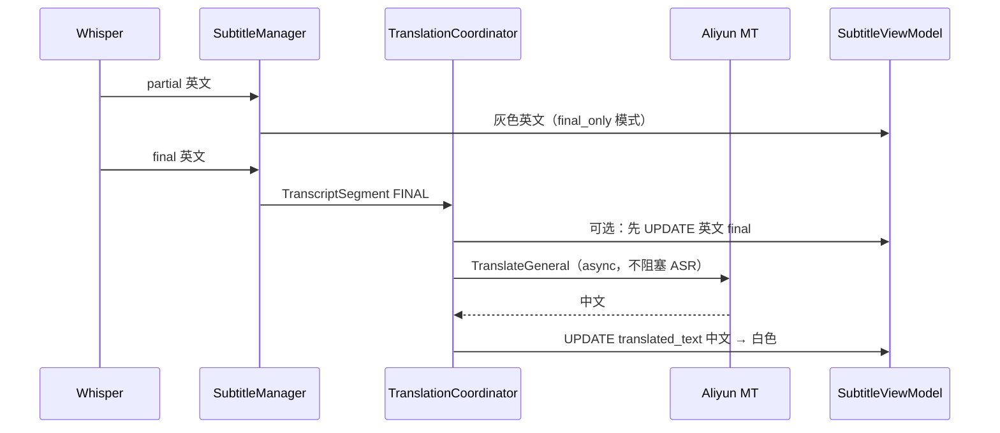

# Phase 3 — 翻译 → 字幕 架构设计

> 状态：设计阶段（Phase 2 已提交：`a4b1dd9`）  
> 核心议题：**极低翻译时延** + **云端翻译（阿里云，非本地 LLM）**  
> 范围：ASR 英文 → 阿里云翻译 → 屏幕显示**中文**字幕

---

## 1. Phase 3 要解决的问题

Phase 2 已在屏幕上显示 **英文 ASR 原文**（白/灰双区）。Phase 3 让用户看到 **中文译文**，且翻译延迟不能成为体验瓶颈。

| 用户感知 | 技术含义 |
|----------|----------|
| 「句末很快变成中文」 | final 定稿后 **< 500 ms** 出现中文白字 |
| 「说话过程中有反馈」 | partial 区可选策略：英文占位或 debounce 中文预览 |
| 「不依赖本地大模型」 | 移除 Ollama 路径，改用 **阿里云 API** |
| 「密钥安全」 | API Key / AccessKey **仅环境变量**，不入库 |

---

## 2. 与 Phase 2 的衔接

### 2.1 当前数据流（Phase 2）

```
环回音频 → VAD → Whisper partial/final → SubtitleManager
                                              ↓
                                    source_text = translated_text = 英文
                                              ↓
                                    SubtitleViewModel（白/灰）
```

### 2.2 目标数据流（Phase 3）

```
环回音频 → VAD → Whisper partial/final → SubtitleManager（英文 source_text）
                                              ↓
                                    TranslationCoordinator（异步）
                                              ↓
                                    填充 translated_text = 中文
                                              ↓
                                    SubtitleViewModel（显示中文）
```

### 2.3 字段语义（定稿）

| 字段 | Phase 2 | Phase 3 |
|------|---------|---------|
| `SubtitleLine.source_text` | 英文 ASR | **英文 ASR（保留）** |
| `SubtitleLine.translated_text` | 同英文 | **中文译文（UI 主显示）** |
| 灰色 live 区 | 英文 partial | **可配置：英文占位 / 中文预览** |
| 白色 history 区 | 英文 final | **中文 final** |

---

## 3. 翻译后端选型：为何不用本地 Ollama

| 方案 | 典型延迟 | 结论 |
|------|----------|------|
| Ollama qwen2.5:7b（原 ARCHITECTURE） | 1–5 s / 句 | **不满足**「时延十分低」 |
| Ollama 小模型 | 0.5–2 s | 仍偏慢，且占本地 GPU/内存 |
| **阿里云机器翻译 TranslateGeneral** | **百毫秒级**解码 + 网络 RTT | **Phase 3 默认推荐** |
| DashScope Qwen-MT-lite（API Key） | 流式首 token 较快 | 备选，适合「单 API Key」运维 |

**结论**：Phase 3 **默认使用阿里云机器翻译（NMT 专用 API）**，不用生成式 LLM 做逐句翻译。

---

## 4. 阿里云接入方案

### 4.1 推荐：机器翻译通用版 `TranslateGeneral`

| 项 | 说明 |
|----|------|
| 产品 | [阿里云机器翻译 - 通用版](https://help.aliyun.com/zh/machine-translation/product-overview/general-version-of-machine-translation) |
| API | `TranslateGeneral`（2018-10-12） |
| 端点 | `mt.cn-hangzhou.aliyuncs.com`（国内） |
| 语种 | `SourceLanguage=en` → `TargetLanguage=zh` |
| 性能 | 官方：**单机单句百毫秒级**；QPS 上限 50/s（账号级） |
| 认证 | **AccessKey ID + AccessKey Secret**（RAM 子账号推荐） |

> 用户口语中的「API_KEY」：若指 **DashScope 的 sk-xxx**，见 §4.2；若指 **阿里云访问密钥**，即 AccessKey 对，通过环境变量注入（§6）。

### 4.2 备选：DashScope API Key + Qwen-MT

| 项 | 说明 |
|----|------|
| 适用 | 已统一使用百炼 `DASHSCOPE_API_KEY`，希望流式输出 |
| 模型 | `qwen-mt-lite`（低延迟）/ `qwen-mt-plus`（高质量） |
| 延迟 | 流式首 chunk 较快，但通常仍 **慢于专用 NMT API** |
| 定位 | `provider = "dashscope_mt"` 备选档，非默认 |

### 4.3 不推荐

- 通用 Qwen Chat 做翻译（Prompt 翻译）：延迟高、成本高、不稳定
- 本地 Ollama：与 Phase 3 目标冲突

---

## 5. 低延迟翻译策略（核心设计）

翻译延迟 = **网络 RTT** + **API 处理** + **流水线调度**。目标是在 **不阻塞 ASR** 的前提下，尽快把中文送到 UI。

### 5.1 三档策略（配置 `translation.mode`）

| 模式 | partial | final | 延迟 | API 调用量 | 推荐 |
|------|---------|-------|------|------------|------|
| `final_only` | 不翻译，灰色仍显示英文 | 立即翻译 | 句末 +200~400ms | 低 | **默认** |
| `debounced_partial` | 文本稳定 ≥300ms 且变化 ≥N 字再译 | 整句 re-translate | partial 略慢 | 中 | 可选 |
| `parallel` | partial/final 均 fire-and-forget | 同左 | 最快预览 | 高 | 高成本场景 |

**Phase 3 默认：`final_only`**

理由：
- partial 英文每 200ms 变一次，逐条翻译会打满 API 且译文闪烁
- 专用 NMT 译一句 6–20 词仅需 **~200ms 量级**（加 RTT），句末中文可接受
- 灰色英文 + 白色中文 final，符合同声传译「慢半句但句末准确」习惯

### 5.2 异步非阻塞



- 翻译在 **独立 asyncio Task** 中执行，**永不阻塞** `_partial_loop` / 音频线程
- 使用 **httpx.AsyncClient** 连接池（keep-alive），减少 TLS 握手

### 5.3 去重与取消（降延迟 + 省配额）

| 机制 | 说明 |
|------|------|
| **文本 hash 缓存** | LRU：`sha256(en_text) → zh_text`，TTL 1h；重复句零延迟 |
| **in-flight 合并** | 相同原文只发一次 API，多个 await 共享 Future |
| **过期请求丢弃** | partial 模式：新文本到达时 cancel 旧 Task（仅保留最新） |
| **final 优先** | final 翻译排队跳 partial 低优先级任务 |

### 5.4 延迟预算（目标）

| 指标 | 目标 P50 | 目标 P95 |
|------|----------|----------|
| final 英文定稿 → 中文上屏 | ≤ 350 ms | ≤ 800 ms |
| 缓存命中 | ≤ 5 ms | ≤ 10 ms |
| API 单次（国内 en→zh，≤100 字符） | ≤ 200 ms | ≤ 500 ms |

测量：日志打点 `final_asr_at → translate_request → translate_response → ui_emit`。

---

## 6. 配置与安全

### 6.1 配置结构（`resources/default_config.toml`）

```toml
[translation]
enabled = true
provider = "aliyun_mt"          # aliyun_mt | dashscope_mt
mode = "final_only"             # final_only | debounced_partial | parallel
source_language = "en"
target_language = "zh"

# 阿里云机器翻译（TranslateGeneral）
region = "cn-hangzhou"
endpoint = ""                   # 空 = 默认 mt.{region}.aliyuncs.com

# DashScope 备选
dashscope_base_url = "https://dashscope.aliyuncs.com/compatible-mode/v1"
dashscope_model = "qwen-mt-lite"

# 行为
timeout_sec = 3.0
max_retries = 1
cache_size = 500
cache_ttl_sec = 3600
debounce_ms = 300               # debounced_partial 模式
translate_partial_min_chars = 8
show_english_in_partial = true  # final_only 时灰色显示英文
```

### 6.2 密钥（禁止写入 Git）

| 变量 | 用途 |
|------|------|
| `ALIBABA_CLOUD_ACCESS_KEY_ID` | 机器翻译 OpenAPI（推荐） |
| `ALIBABA_CLOUD_ACCESS_KEY_SECRET` | 同上 |
| `DASHSCOPE_API_KEY` | 仅 `provider=dashscope_mt` 时使用 |

`default_config.toml` 中 **不出现** 密钥；启动时从环境变量或 `.env.local`（gitignore）读取。

---

## 7. 模块设计

### 7.1 目录与职责

```
services/translation/
├── __init__.py
├── aliyun_mt_service.py      # TranslateGeneral，实现 ITranslator
├── dashscope_mt_service.py   # 备选：Qwen-MT + API Key
├── translation_cache.py      # LRU + in-flight dedupe
└── factory.py                # create_translator(config)

core/translation/
├── translation_coordinator.py  # 调度 partial/final 翻译策略
└── models.py                 # TranslationRequest / TranslationResult（可选）

core/pipeline/stages/
└── translation_stage.py      # 薄封装，或逻辑并入 coordinator
```

### 7.2 接口扩展

```python
# core/interfaces/translator.py
class ITranslator(Protocol):
    async def translate(
        self,
        text: str,
        *,
        source_lang: str = "en",
        target_lang: str = "zh",
        context: str = "",
    ) -> str: ...
```

```python
# core/translation/translation_coordinator.py
class TranslationCoordinator:
    async def on_subtitle_event(
        self,
        segment: TranscriptSegment,
        subtitle_event: SubtitleEvent | None,
    ) -> SubtitleEvent | None:
        """返回需 emit 的 UPDATE（含中文 translated_text）。"""
```

### 7.3 与 StreamingPipelineOrchestrator 集成

**推荐挂载点**（最小侵入）：

```python
# streaming_orchestrator._emit_partial / _on_utterance_end
subtitle_event = self._subtitle_manager.on_transcript(segment)
if subtitle_event and self._translation.enabled:
    subtitle_event = await self._translation.coordinate(segment, subtitle_event)
await self._emit(subtitle_event)
```

或：`TranslationCoordinator` 包装 `_emit`，对 `SubtitleEvent` 做后处理 UPDATE。

### 7.4 UI 变更

| 组件 | 变更 |
|------|------|
| `SubtitleViewModel` | `get_display_html()` 显示 **`translated_text`（中文）**；可选小字 `source_text` |
| `SubtitleManager` | partial/final 时 `source_text=英文`，`translated_text` 初值可为英文占位，译完后 UPDATE |
| `MainWindow` | 翻译失败时状态栏提示（不阻断 ASR） |

---

## 8. 错误处理与降级

| 场景 | 行为 |
|------|------|
| API 超时（3s） | 保留英文；状态栏「翻译超时」；final 可重试 1 次 |
| 配额 / 鉴权失败 | 错误态 + 仅显示英文 ASR |
| 网络断开 | 英文 fallback，指数退避，不阻塞音频 |
| 空文本 | 跳过翻译 |

**原则**：ASR 与音频采集 **永不因翻译失败而停止**。

---

## 9. Phase 3 任务拆分

### Phase 3a — 最小可用（必须先完成）

```
P0  TranslationConfig 扩展 + 环境变量读取
P0  AliyunMtTranslationService（TranslateGeneral + httpx）
P0  TranslationCoordinator（final_only 模式）
P0  接入 StreamingPipelineOrchestrator
P0  UI 显示 translated_text（中文）
P0  翻译失败降级为英文
P1  LRU 缓存 + in-flight 去重
P1  延迟日志与 scripts/benchmark_translate.py
```

**3a 验收**：播放 `0.wav`，final 后 **≤1s** 出现正确中文白字；API 失败时仍显示英文。

### Phase 3b — 体验增强（可选）

```
P1  debounced_partial 模式（灰色中文预览）
P2  DashScope Qwen-MT 备选 provider
P2  字幕可选双语（中文主 + 英文小字）
P2  翻译队列背压与 metrics
```

---

## 10. 与 ARCHITECTURE.md 的差异

| 原设计 | Phase 3 设计 |
|--------|--------------|
| Ollama 本地 LLM | **阿里云机器翻译 API** |
| TranslationStage 独立队列 | **Coordinator 挂 orchestrator**（与 Phase 2 流式一致） |
| partial 可跳过 | **默认 final_only**；partial 英文占位 |
| `ollama_base_url` | **`region` + AccessKey 环境变量** |

实现 Phase 3 后需同步更新 `ARCHITECTURE.md` 与 `README.md`。

---

## 11. 风险与缓解

| 风险 | 缓解 |
|------|------|
| 网络 RTT 高于预期 | 国内 region；连接池；缓存；final_only 减少调用 |
| API 费用 | final_only；缓存；debounce；监控字符量 |
| 密钥泄露 | 仅 env；CI 用 RAM 子账号；最小权限 |
| 译文质量（术语） | 可选 `Scene=general`；Phase 3b 加 `Context` 上一句 |
| partial 译中文闪烁 | 默认不译 partial |

---

## 12. 下一步

1. **确认认证方式**：AccessKey 对（推荐）还是 DashScope API Key？
2. **确认 partial 策略**：默认 `final_only` 是否接受？
3. **确认 UI**：仅中文，还是中文 + 英文小字双语？
4. 按 Phase 3a P0 清单开始实现

---

*维护：实现过程中若调整延迟目标或 API 选型，请同步更新本文档第 5.4 节实测表。*
